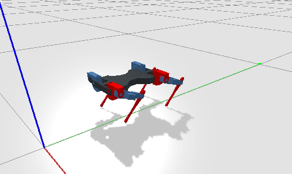
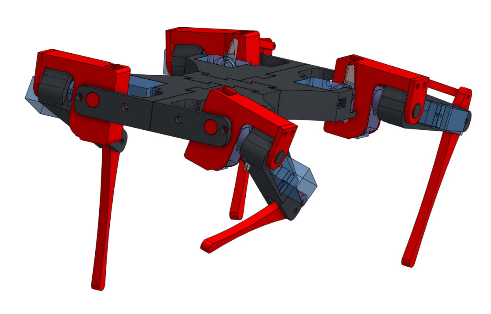

# Ca_bot

## CAD
You can view the CAD on OnShape [here](https://cad.onshape.com/documents/ce9bda5ae462e3fdef104bd6/w/3b8d4f6b6a3cb61aacb198cc/e/690f3e74afa6e9599cd381d0)

## Simulation

I used [OnShape-to-robot](https://github.com/Rhoban/onshape-to-robot) and PyBullet to simulate the robot. 
Follow the instructions to import the robot from OnShape. Then, you can use the `bullet.py` (in Ca_bot repo) to perform the simulation. It uses Onshape-to-robot's simulation.py, so you will have to link the imports yourself

## Kinematics
(latex file with inverse kinematics explainations is coming)

## BOM
TODO

## STL Files
TODO (list of files, number of files to print etc)

## Sources utiles
- https://forum.arduino.cc/index.php?topic=597809.0

